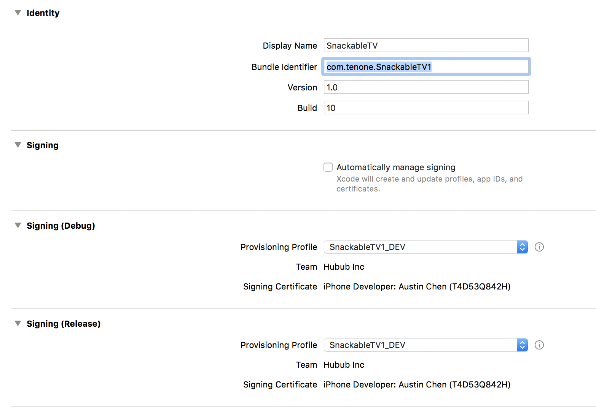
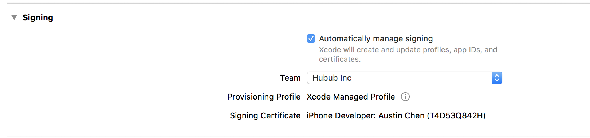
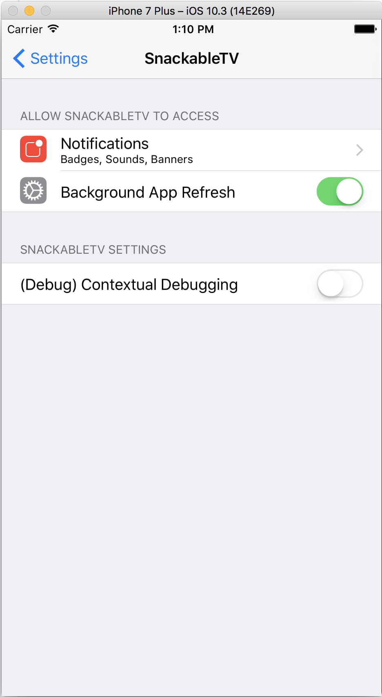
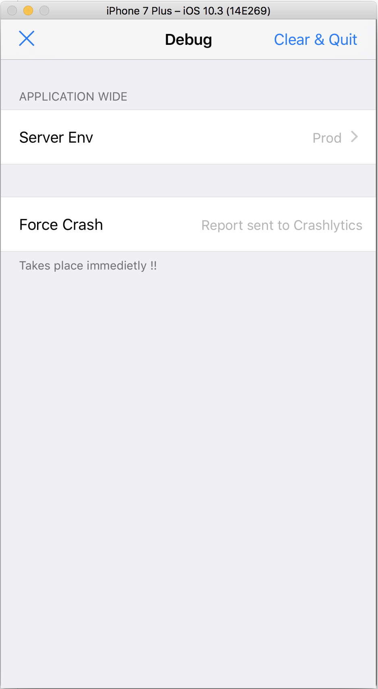

## Project Setup:

1. "pod install" at podfile directory

2. build & run

## Urban Airship Keys * Secrets:

**In house**

```
<dict>
	<key>developmentAppKey</key>
	<string>_NCFlG3TRJSogM6cAM3xpw</string>
	<key>developmentAppSecret</key>
	<string>T1gnToIuSDuZTAYj8H2SaA</string>
	<key>productionAppKey</key>
	<string>9Q7QRGIET9yOkktoajJiJA</string>
	<key>productionAppSecret</key>
	<string>izYAMGRoT7GGsfoRIMRDYg</string>
</dict>
```

**Bell Media**

```
<dict>
	<key>developmentAppKey</key>
	<string>XijwcBFCQJujQnsWyCPtRg</string>
	<key>developmentAppSecret</key>
	<string>qFVo8tTqRlS8es0unW4YOg</string>
	<key>productionAppKey</key>
	<string>JCy4HJnrT5a9M8bqPZVe_w</string>
	<key>productionAppSecret</key>
	<string>4c2MglmdRmmnoBrYIyRA0Q</string>
</dict>
```

## Making a release candidates: (builder role)

Since we follow github-flow branching methods, a builder need to take the latest from 'master' branch to create a release branch to pool the relevent commits together for making such build

1. merge all pending pull requests targeted towards 'master' branch

2. update 'master' branch & merge master branch to 'release/1.0.x'

	2.x make hotfixes and keep them tracked in git, if encounted  

3. Remove **Debug Aids** if necessary

4. for bundle ID, use "**com.tenone.SnackableTV1**" for inHouse build, "**ca.bellmedia.snackabletv**" for external build (Hockey App build)

5.  for **inHouse** build, uncheck Automatically Manage Signing, and download and use SnacableTV1_DEV provisioning profile; Also **TURN ON** Push Notification

	
	
	for **external** build, check Automatically Manage Signing; Also **TURN OFF** Push Notification to avoid build error (Bell team can re-sign the xcarchive with whatever entitlements they want.)
	
	

6. increment the 'Version' & 'Build', or both. 
    (current convention: incrementing number in bracket for each weekly release. eg, 1.0 (1), 1.0 (2) etc.
    incrementing the build number for each build attempts for a specific release) 

7. build clean on XCode, then do a 'pod install'

8. select target to be 'Generic iOS Device', then 'Archive'

9. for **inHouse** build, prepare release notes, and add both release notes and the build to Fabric.io for beta testing; for **external** build, find the .xcarchive file, compress it and send it over

10. tag the build, then check in all the hotfixes and etc, then merge 'release/1.0.x' back to 'master' branch


##  Make a build from a git commit of the past: 

One would want to follow these procedures to make a build as exact as the build made by the builder in the past.

1. check out the commit/tag from git

2. do a 'pod install' (there is a huge difference between 'pod install' and 'pod update', please consult Cocoapods for details)

3. build or run


## Debug Aids:

### Enable Contextual Debugging:

**1.** Go to Settings App, and find SnackableTV

**2.** Switch on Contextual Debugging
	

**3.** Kill and relaunch the app
	

### Switch Host:

After enabled contextual debugging, please go through in sequence

**1.** Tap "(Debug) Settings" button on Menu page
	

**2.** Tap "Clear & Quit" to purge local data, and relaunch (to avoid using inconsistent data across host)

**3.** Switch host, and continue on with the app
